<div align="center">

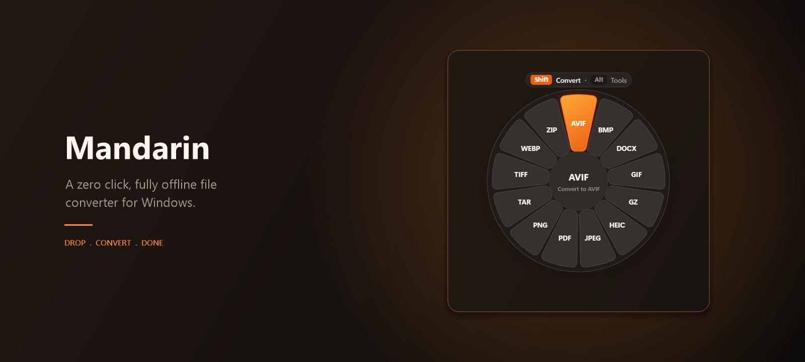

<p>
  <a href="https://dotnet.microsoft.com/download/dotnet/8.0"></a>
  
  
  
  
</p>

<p><b>Hold Shift, drag any file, pick a format. Done.</b><br>
No panel to find, no upload, no sign in, no wizard. Everything runs on your machine.</p>

</div>

---

## Contents

[Overview](#overview) · [The two gestures](#the-two-gestures) · [Advanced tools](#advanced-tools) ·
[Supported formats](#supported-formats) · [Themes and language](#themes-and-language) ·
[Architecture](#architecture) · [Getting started](#getting-started) ·
[Building and publishing](#building-and-publishing) · [Explorer integration](#explorer-integration) ·
[Project layout](#project-layout) · [Design principles](#design-principles) · [Roadmap](#roadmap)

---

## Overview

Mandarin is a file converter that stays out of the way. It has no window and no icon on
your desktop, just a tray icon. Hold Shift and drag any file, from anywhere, and the
radial wheel opens right at your cursor; release over a format and the conversion
happens in place, with no file ever leaving the machine.

|  |  |
|---|---|
| **Zero click** | Hold Shift while dragging and Mandarin converts straight to the last used format. No dialog at all. |
| **Fully offline** | No network calls anywhere in the codebase, no telemetry, no analytics, no update pings. |
| **Never blocks** | Conversions run async with a cancellable progress HUD. Bad input produces a message, never a crash. |
| **Single executable** | Publishes as one self contained `.exe`. No .NET runtime, no installer, no admin rights. |
| **Native look** | Windows 11 acrylic dialogs, system light and dark theme, English and Turkish. |

## The two gestures

There is no window to drop a file onto. Instead, hold Shift while dragging any file,
from any app or folder, and the wheel opens under your cursor.

<table>
<tr>
<td width="50%" align="center" valign="top">
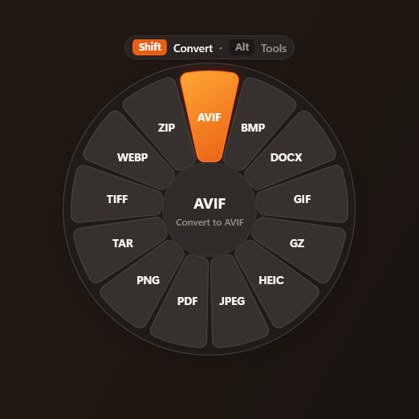
<br><b>Shift + drag</b>
<br><sub>The radial wheel lists every format the file can become. Keyboard navigable, or release over a petal.</sub>
</td>
<td width="50%" align="center" valign="top">
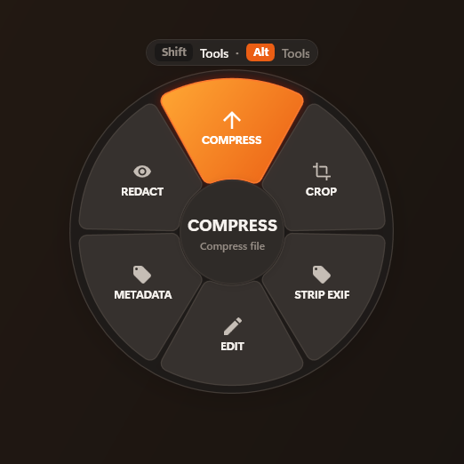
<br><b>Shift + Alt + drag</b>
<br><sub>The same wheel switches to the advanced tools available for that file type.</sub>
</td>
</tr>
</table>

| Gesture | Result |
|---|---|
| Shift + drag, release over a petal | Convert to that format |
| Shift + Alt + drag, release over a petal | Run that advanced tool |
| Shift + drag several files, release in the centre | Batch conversion, all files to one target format |
| Shift + Alt + drag several files of one type | Merge them into a single file |
| Right-click a file, **Convert with Mandarin** | Opens the wheel without needing Shift |

<div align="center">
  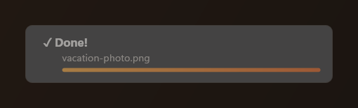
  <br>
  <sub>Progress is cancellable, and the result opens the output folder on click.</sub>
</div>

## Advanced tools

Each tool previews the exact file it is about to write before you commit, using the same
naming helper the tool itself uses, so the preview cannot drift from the real output.

<table>
<tr>
<td width="50%" align="center" valign="top">
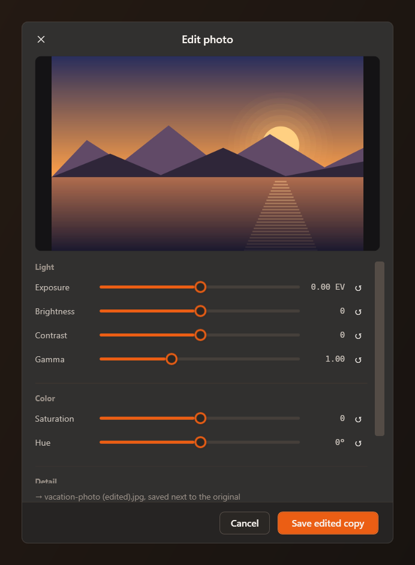
<br><b>Edit photo</b>
<br><sub>Exposure, brightness, contrast, gamma, saturation and hue, with per slider reset.</sub>
</td>
<td width="50%" align="center" valign="top">
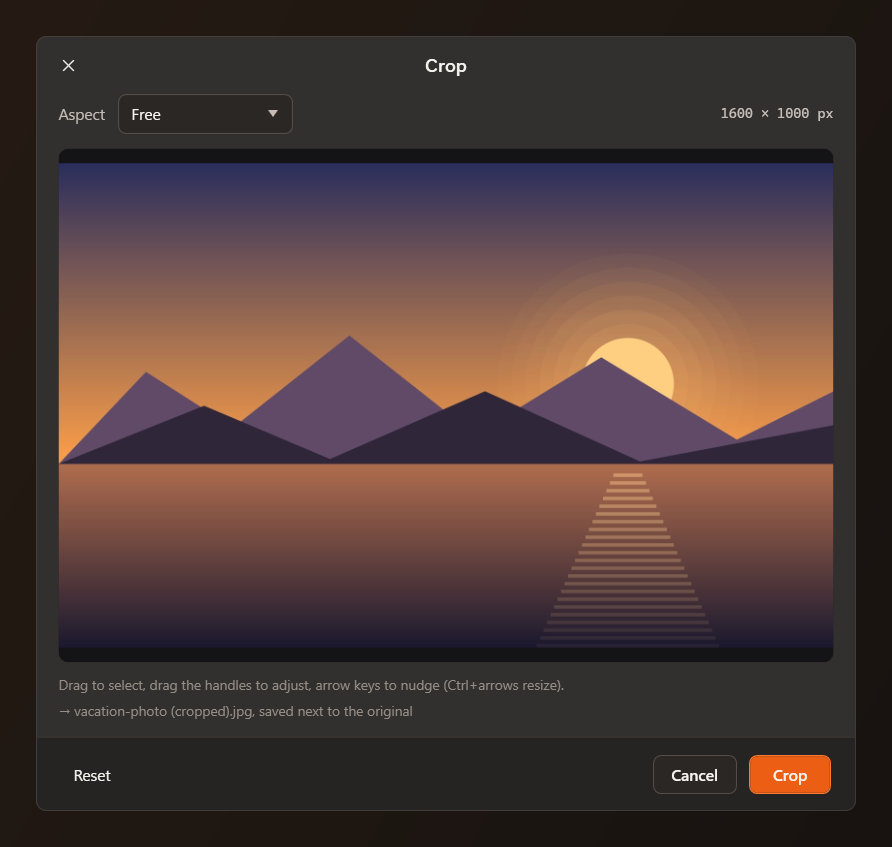
<br><b>Crop</b>
<br><sub>Free or fixed aspect, handles to adjust, arrow keys to nudge. Works for images and video.</sub>
</td>
</tr>
<tr>
<td width="50%" align="center" valign="top">
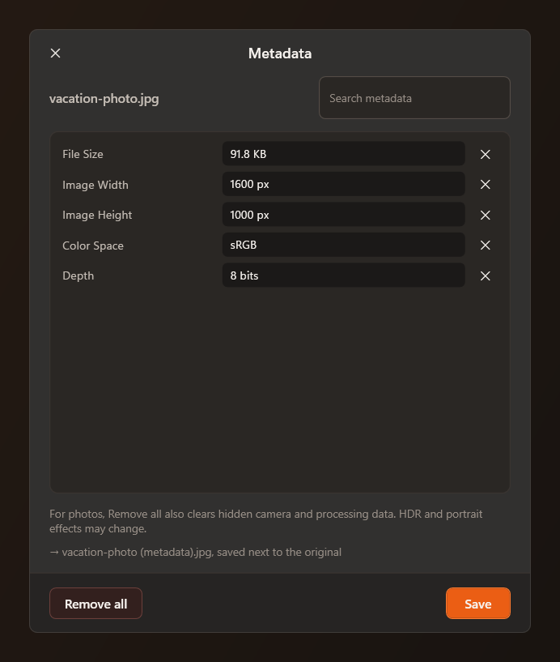
<br><b>Metadata</b>
<br><sub>Inspect, search, remove single fields, or strip everything including hidden camera data.</sub>
</td>
<td width="50%" align="center" valign="top">
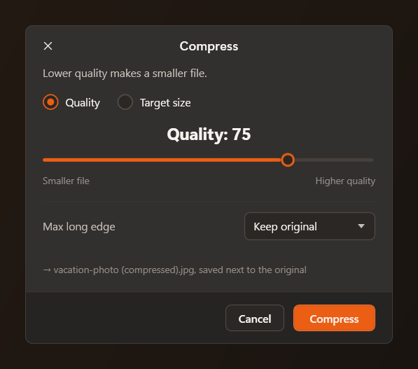
<br><b>Compress</b>
<br><sub>Target a quality level or a target file size, with an optional maximum long edge.</sub>
</td>
</tr>
</table>

Also available: **trim** (video and audio), **split** (PDF page ranges, media at a
timestamp), **redact** (images and video), **strip metadata** and **merge**.

## Supported formats

| Category | Formats |
|---|---|
| **Images** | JPG, PNG, WebP, HEIC, TIFF, AVIF, BMP, GIF, SVG (read), plus export to PDF and DOCX |
| **Video** | MP4, MOV, MKV, WebM, AVI, WMV, GIF, including extraction of the audio track |
| **Audio** | MP3, M4A, WAV, FLAC, OGG, Opus, AIFF, WMA |
| **PDF** | To DOCX, to JPG or PNG at 300 DPI for all pages, to TXT. From TXT to PDF |
| **Text** | TXT to PDF, JPG, PNG, SRT, VTT |
| **Subtitles** | SRT, VTT and TXT, in every direction |
| **Archives** | Create and extract ZIP, TAR and GZIP. Extract only for RAR |

Image work is handled by Magick.NET, PDF by PdfPig, PDFtoImage and PdfSharpCore, archives
by SharpCompress, and video and audio by a bundled local `ffmpeg.exe` invoked as a process
behind an interface, so it can be mocked in tests.

## Themes and language

The theme follows the Windows app mode live, or can be pinned to light or dark. Every
colour in the app is a token resolved through `DynamicResource`, so the switch applies
instantly without restarting. The interface ships in English and Turkish.

<table>
<tr>
<td width="50%" align="center">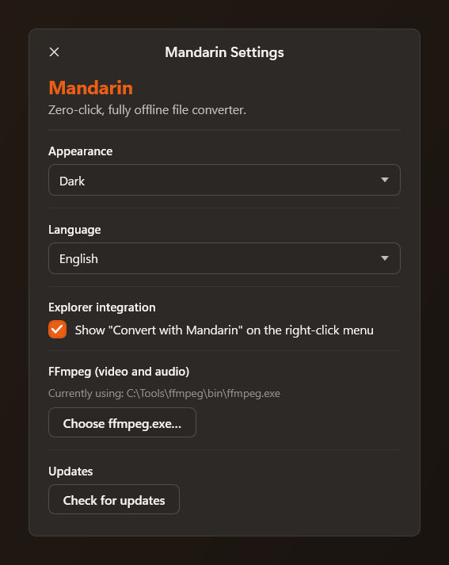<br><sub>Dark</sub></td>
<td width="50%" align="center">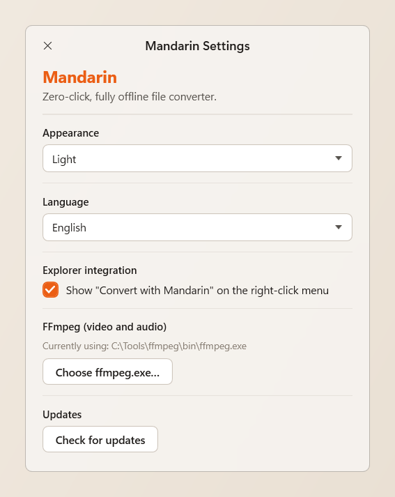<br><sub>Light</sub></td>
</tr>
</table>

## Architecture

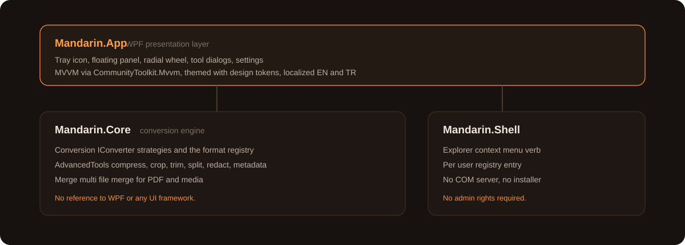

Two rules shape the codebase:

1. **`Mandarin.Core` never references a UI framework.** The conversion engine is usable
   from a CLI or a different front end without touching a line of it.
2. **A new format is a new `IConverter`.** Formats are registered as strategies, never
   added to a growing switch statement.

## Getting started

**For most people:** grab `MandarinSetup.exe` from the
[latest release](https://github.com/sametgurtuna/mandarin/releases/latest) and run it.
It installs per user to `%LocalAppData%\Programs\Mandarin`, needs no admin rights, and
offers a "start Mandarin when Windows starts" checkbox (on by default) so it is always
running after a restart, ready in the tray. The installer is unsigned, so Windows
SmartScreen shows a one-time "unknown publisher" warning on first run; choose
**More info, Run anyway**.

Prefer to run without installing? Grab the standalone `Mandarin.App.exe` from the same
release page and put it wherever you like.

**To build from source:** Windows 10 or 11, and the
[.NET 8 SDK](https://dotnet.microsoft.com/download/dotnet/8.0).

```bash
git clone https://github.com/sametgurtuna/mandarin.git
cd mandarin
dotnet run --project src/Mandarin.App
```

### FFmpeg for video and audio

Image, PDF, text and archive conversion work out of the box. Video and audio need
`ffmpeg.exe`, which Mandarin never downloads and never bundles, for licensing reasons.
Grab an LGPL build from [gyan.dev](https://www.gyan.dev/ffmpeg/builds/) or
[BtbN](https://github.com/BtbN/FFmpeg-Builds), then either:

- drop it next to the built app at
  `src/Mandarin.App/bin/<Debug|Release>/net8.0-windows/ffmpeg/ffmpeg.exe`,
- set `MANDARIN_FFMPEG_PATH` to its full path, or
- point at it from **Settings, Choose ffmpeg.exe**.

Without it, video and audio actions open a setup dialog instead of failing silently.

## Building and publishing

```bash
dotnet build                                  # build the solution
dotnet test                                   # run the Core and Shell test suites
dotnet run --project src/Mandarin.App         # run the app
```

Publish a self contained single file executable, which is how Mandarin is distributed:

```bash
dotnet publish src/Mandarin.App/Mandarin.App.csproj -c Release -r win-x64 \
  --self-contained true -p:PublishSingleFile=true \
  -p:IncludeNativeLibrariesForSelfExtract=true -o publish
```

The result runs on a machine with no .NET runtime installed. There is no MSIX package,
because MSIX needs a code signing certificate for real distribution.

Wrap that build into the installer with [Inno Setup 6](https://jrsoftware.org/isinfo.php)
(`winget install JRSoftware.InnoSetup`):

```bash
"%LocalAppData%\Programs\Inno Setup 6\ISCC.exe" installer\mandarin.iss
```

That produces `installer-output\MandarinSetup.exe`: a per-user installer with a Start
Menu shortcut, an optional desktop icon, and the startup task described above. It needs
no admin rights either, same as the app itself.

## Explorer integration and startup

Settings has a checkbox that adds **Convert with Mandarin** to the Explorer context menu
for every file type, and one that starts Mandarin automatically when Windows starts.
Both are classic per user registry entries: no COM server, no scheduled task, no admin
rights, and unticking either box removes it cleanly. The Explorer entry launches
Mandarin with the selected file and opens the format wheel for it; the startup entry
launches it quietly into the tray, without stealing focus.

## Project layout

```
Mandarin.slnx
src/
  Mandarin.App/          WPF UI: tray icon, radial wheel, dialogs
    Themes/              design tokens, control styles, light and dark palettes
    Resources/           Strings.resx and Strings.tr.resx localization
    ViewModels/          MVVM view models
    Views/               windows and dialogs
  Mandarin.Core/         conversion engine, no UI references
    Conversion/          IConverter implementations and the format registry
    AdvancedTools/       compress, crop, trim, split, redact, metadata
    Merge/               multi file merge
    Settings/            JSON settings under %AppData%\Mandarin
  Mandarin.Shell/        Explorer context menu and startup registration
tests/
  Mandarin.Core.Tests/
  Mandarin.Shell.Tests/
installer/               Inno Setup script that builds MandarinSetup.exe
assets/                  icon and README images
```

## Design principles

- **Offline is a hard rule, not a default.** There is no network code in the project.
- **Never crash on bad input.** Corrupt files, missing codecs and unsupported pairs
  produce a clear message and leave the app running.
- **Async all the way.** No conversion ever blocks the UI thread.
- **Styling lives in `Themes/`.** No hardcoded colours, font sizes or corner radii in
  views. Code built UI reads the same tokens.
- **Honest previews.** A tool that could not fully honour a request reports a warning
  instead of a plain success.

## Roadmap

`PLAN.md` holds the full phase by phase history and the current plan.

| Phase | Scope | Status |
|---|---|---|
| 0 | Solution skeleton and project boundaries | Done |
| 1 | Image conversion and the floating panel | Done |
| 2 | Video and audio through FFmpeg | Done |
| 3 | PDF, text and subtitles | Done |
| 4 | Archives | Done |
| 5 | Advanced tools behind the Shift and Alt wheel | Done |
| 6 | Batch drop, merge, Explorer integration, packaging, localization | Done |
| - | Design system, acrylic dialogs, light and dark themes, tool dialog polish | Done |

Still open: a batch queue with per file status, and one click presets as a second ring on
the wheel.

## Acknowledgements

Mandarin is inspired by [Tangerine for Mac](https://tangerineformac.com). The concept of
a zero click drop target is theirs; the implementation, interface and artwork here are
original.

<div align="center">
<sub>Built for Windows. Runs entirely on your machine.</sub>
</div>
