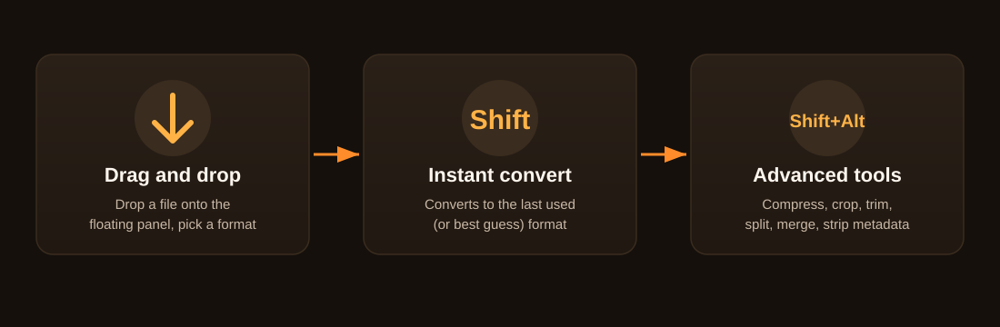

<div align="center">


<br/>

[](https://dotnet.microsoft.com/download/dotnet/8.0)
[](#)
[](#)
[](#)
[](#)

**A zero click, fully offline file converter for Windows.**
Inspired by [Tangerine for Mac](https://tangerineformac.com).

</div>

---

## Table of contents

- [Features](#features)
- [How it works](#how-it-works)
- [Supported formats](#supported-formats)
- [Architecture](#architecture)
- [Getting started](#getting-started)
- [Commands](#commands)
- [Explorer integration](#explorer-integration)
- [Project structure](#project-structure)
- [Roadmap](#roadmap)
- [Contributing](#contributing)

---

## Features

<table>
<tr>
<td width="33%" valign="top">

### 🎯 Zero click
Drop a file onto the floating panel and pick a format. The whole conversion takes seconds.

</td>
<td width="33%" valign="top">

### 🔒 Fully offline
No network calls at all. No analytics, no telemetry, no silent background connections.

</td>
<td width="33%" valign="top">

### 🌗 Light / dark theme
Follows the Windows system theme live, or can be set to light or dark manually.

</td>
</tr>
<tr>
<td width="33%" valign="top">

### ⚡ Batch conversion
Drop several files at once and convert all of them to a single target format.

</td>
<td width="33%" valign="top">

### 🧰 Advanced tools
Compress, crop, trim, split, merge, and strip metadata, all in one panel.

</td>
<td width="33%" valign="top">

### 🖱️ Explorer integration
Adds a single "Convert with Mandarin" entry to the right click menu.

</td>
</tr>
</table>

## How it works



| Gesture | Result |
|---|---|
| **Drop** | Pick a target format from a keyboard navigable popup |
| **Shift + drop** | Converts instantly to the last used (or best guess) format |
| **Shift+Alt + drop** | Opens advanced tools: compress, crop, trim, split, strip metadata |
| **Shift+Alt + drop multiple** (same type) | Merges the files into one |
| **Drop multiple files** | Batch converts all of them to one target format |

## Supported formats

| Category | Formats |
|---|---|
| 🖼️ **Images** | JPG, PNG, WebP, HEIC, TIFF, AVIF, BMP, GIF, SVG (read), plus export to PDF/DOCX |
| 🎬 **Video / audio** | MP4, MOV, MKV, WebM, AVI, WMV, GIF, MP3, M4A, WAV, FLAC, OGG, Opus, AIFF, WMA |
| 📄 **PDF** | PDF → DOCX, JPG/PNG (300 DPI, all pages), TXT · TXT → PDF, JPG, PNG, SRT, VTT |
| 💬 **Subtitles** | SRT ↔ VTT ↔ TXT |
| 🗜️ **Archives** | Create/extract ZIP, TAR, GZIP · extract only for RAR |
| 🛠️ **Advanced tools** | Compress (quality slider), crop, trim, split, strip metadata, merge |

## Architecture


`Mandarin.Core` never references WPF or any UI framework, so the same conversion engine
can later be reused from a CLI or a different front end. Adding a new format means
adding a new `IConverter` implementation, never growing an if/else chain.

## Getting started

1. Install the [.NET 8 SDK](https://dotnet.microsoft.com/download/dotnet/8.0).
2. Video/audio features need `ffmpeg.exe`, which Mandarin **never downloads or
   bundles** (licensing reasons, see `CLAUDE.md`). Get an LGPL build from
   [gyan.dev](https://www.gyan.dev/ffmpeg/builds/) or
   [BtbN's builds](https://github.com/BtbN/FFmpeg-Builds), and either:
   - place it at `src/Mandarin.App/bin/<Debug|Release>/net8.0-windows/ffmpeg/ffmpeg.exe`
     (next to the built app), **or**
   - set the `MANDARIN_FFMPEG_PATH` environment variable to its full path.

## Commands

```bash
dotnet build                                  # build everything
dotnet test                                   # run all tests (Core + Shell)
dotnet run --project src/Mandarin.App         # run the app
```

Publish a distributable, self contained single exe (no .NET runtime needed on the
target machine):

```bash
dotnet publish src/Mandarin.App/Mandarin.App.csproj -c Release -r win-x64 \
  --self-contained true -p:PublishSingleFile=true \
  -p:IncludeNativeLibrariesForSelfExtract=true -o publish
```

## Explorer integration

Settings has a "Show 'Convert with Mandarin' on the right click menu" checkbox. It
adds a single static verb to Explorer's context menu for every file type, a classic
per user registry entry that needs no installer or admin rights. This is a single
menu entry, not a per format submenu; see the Packaging section in `CLAUDE.md` for why.

## Project structure

```
Mandarin.slnx
src/
  Mandarin.App/       WPF UI: tray icon, floating panel, ViewModels, views
  Mandarin.Core/       Conversion engines, advanced tools, merge, format registry
                        (no WPF/UI references, usable from a CLI or another front end)
  Mandarin.Shell/       Explorer right click integration
tests/
  Mandarin.Core.Tests/
  Mandarin.Shell.Tests/
assets/                icons, color palette
PLAN.md                phase by phase roadmap
CLAUDE.md              architecture notes and conventions for AI assisted development
```

See `CLAUDE.md` for architecture conventions and hard rules, and `PLAN.md` for the
full phase by phase history of how this was built.

## Roadmap

The detailed phase by phase plan lives in `PLAN.md`. In short:

- ✅ **Phase 1**: Core image/PDF/text conversion and the panel UI
- ✅ **Phase 2**: Video/audio conversion (ffmpeg integration)
- ✅ **Phase 3**: Advanced tools (compress, crop, trim, split, merge, metadata)
- ✅ **Phase 4**: Theme system, localization (EN/TR), Explorer integration
- 🔄 **Phase 5+**: Maintenance, polish, and feature work driven by user feedback

## Contributing

This project is under active development. Feel free to open an issue for bugs or
feature requests.

<div align="center">

---

Made with 🍊 for Windows

</div>
